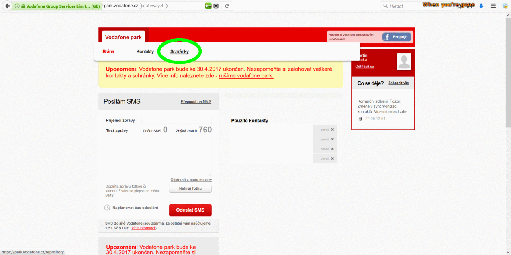

# Export všech zpráv z Vodafone parku

Skript pro export všech zpráv z SMS schránek Vodafone parku do CSV souborů.

Vodafone park umožňuje exportovat max. 100 zpráv najednou, a tento skript pouze automatizuje klikání na "Následující" a "Export do XLS".

***Pozor, 30. 4. 2017 přestane Vodafone park fungovat!***

## Instalace

Tento postup využívá iMacros doplněk pro Firefox/Chrome. Byl vytvořen ve Firefoxu, ale v Google Chrome by měl fungovat také.

1. Nainstalujte doplněk iMacros ([pro Firefox](https://addons.mozilla.org/cs/firefox/addon/imacros-for-firefox/), [pro Chrome](https://chrome.google.com/webstore/detail/imacros-for-chrome/cplklnmnlbnpmjogncfgfijoopmnlemp) )
1. Restartujte prohlížeč
1. Otevřete složku s iMacros makry ve správci souborů a zkopírujte do ní soubor [vf-park.iim](https://raw.githubusercontent.com/peci1/vfpark-export-all/master/vf-park.iim) z tohoto repozitáře. Nevíte-li, kde složka s makry je, otevřete nastavení iMacros, a na záložce `Paths` uvidíte položku `Folder Macros`.

## Použití

1. Otevřete v prohlížeči SMS schránky na Vodafone parku a počkejte, až se zprávy načtou.
1. Na zprávy můžete aplikovat libovolný filtr, klikněte na Příchozí/Odchozí podle toho, které zprávy chcete exportovat.
1. V dolní části stránky vyberte, že chcete zobrazovat 100 zpráv na stránku.
1. Otevřete postranní panel iMacros
1. V postranním panelu iMacros klikněte na skript `vf-park.iim`. Zvolte záložku `Play`.
1. V dolní části do kolonky `Max` napište číslo, které je větší než očekávaný počet zpráv / 100. Nevíte-li, napište sem 100. Vodafone Park ukládá zprávy pouze 2 roky zpět.
1. Klikněte na `Play (Loop)` a nic víc nedělejte. Neopouštějte prohlížeč a nepřepínejte na jinou aplikaci. Po několika minutách ukládání skončí a můžete opět počítač ovládat.
1. Exportované CSV soubory najdete v iMacros složce pro stažené soubory (ne v obvyklé složce, kam prohlížeč ukládá stažebné soubory). Umístění této složky opět najdete v nastaveních iMacros.

## Poznámky

1. Během vykonávání skriptu se zdá, jako by se obsah výpisu neaktualizoval. Napanikařte, je to jen problém vykreslování - ukládání probíhá správně.
1. CSV jsou textové soubory se zápisem tabulek, které je možné otevřít editory prostého textu nebo tabulkovými procesory (Libreoffice Calc, Microsoft Excel). Neotevírejte je ve Wordu!
1. Vyexportované CSV není korektní. Není comma-separated (oddělené čárkami), ale semicolon-separated (oddělené středníky). Středníky v textu zpráv ale nejsou nijak escapované, a programy, ve kterých CSV otevřete, jsou tím zmateny. Dá se to spravit přidáním `"""` za 3. středník a na konec každého řádku. Ve Vimu/Sedu toho docílíte příkazem `:% s/^\(\([^;]*;\)\{3\}\)\(.*\)$/\1"""\3"""/`
1. Ve vyexportovaném CSV jsou některé speciální znaky uvedeny jako HTML escape sekvence. Např. místo `&` uvidíte `&amp;`. [Zde](http://www.theukwebdesigncompany.com/articles/entity-escape-characters.php) je jejich seznam. K nahrazení stačí použít funkci "Najít a nahradit".
1. Pro spojení CSV souborů do jednoho použijte libovolný program na spojování textových souborů, např `cat` na Linuxu. Můžete je spojit i prostým copy&paste obsahu všech souborů do jednoho.
